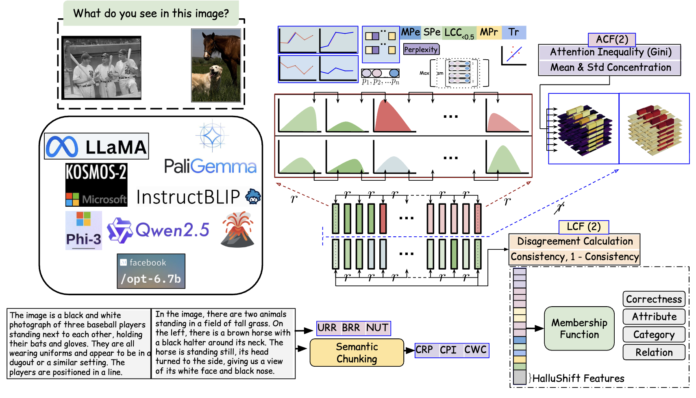

# HalluShift++: Bridging Language and Vision through Internal Representation Shifts for Hierarchical Hallucinations in MLLMs

[](https://www.python.org/downloads/release/python-380/)
[](https://pytorch.org/)
[](https://opensource.org/licenses/MIT)

This repository contains the official implementation of **HalluShift++**, a comprehensive framework for detecting and classifying semantic hallucinations in MLLMs.



## 🚀 Key Features

- **Multi-Modal Support**: Works with both Multimodal Large Language Models (MLLMs) and Large Language Models (LLMs)
- **Hierarchical Classification**: Distinguishes between Category, Attribute, and Relation hallucinations
- **Advanced Feature Engineering**: 74 sophisticated features including perplexity, attention patterns, and semantic consistency
- **Multiple Model Support**: Tested with 10+ state-of-the-art LLM and MLLMs

## 📋 Table of Contents

- [Installation](#installation)
- [Supported Models](#supported-models)
- [Supported Datasets](#supported-datasets)
- [Quick Start](#quick-start)
- [Feature Extraction](#feature-extraction)
- [Training Classifiers](#training-classifiers)
- [Evaluation](#evaluation)
- [Project Structure](#project-structure)
- [Citation](#citation)

## 🛠️ Installation

### Prerequisites

- Python 3.8 or higher
- CUDA-capable GPU (recommended)
- 16GB+ RAM (24GB+ recommended for full training)

### Environment Setup

1. **Clone the repository:**
```bash
git clone https://github.com/C0mRD/HalluShift_Plus
cd HalluShift_Plus
```

2. **Create a virtual environment:**
```bash
python -m venv hallushift_env
source hallushift_env/bin/activate  # On Windows: hallushift_env\Scripts\activate
```

3. **Install dependencies:**
```bash
pip install -r requirements.txt
```

4. **Install additional dependencies for specific models:**
```bash
# For spaCy NLP processing
python -m spacy download en_core_web_sm

# For BLEURT evaluation (text datasets)
pip install bleurt
```

5. **Set up Hugging Face token:**
```bash
# Replace with your actual token in hallushift_plus.py line 36
hf_token = "your_huggingface_token_here"
```

## 🤖 Supported Models

### Vision-Language Models (VLMs)
| Model | Model ID | Type |
|-------|----------|------|
| **LLaVA 1.5** | `llava-hf/llava-1.5-7b-hf` | llava |
| **Llama 3.2 Vision** | `meta-llama/Llama-3.2-11B-Vision` | mllama |
| **InstructBlip** | `Salesforce/instructblip-vicuna-7b` | instructblip |
| **Kosmos-2** | `microsoft/kosmos-2-patch14-224` | kosmos |
| **Phi-3.5 Vision** | `Lexius/Phi-3.5-vision-instruct` | phi |
| **Qwen2.5-VL** | `Qwen/Qwen2.5-VL-3B-Instruct` | qwen |
| **PaliGemma** | `google/paligemma-3b-mix-224` | paligemma |

### Large Language Models (LLMs)
| Model | Model Key | Model ID |
|-------|-----------|----------|
| **Llama2 7B** | `llama2_7B` | `meta-llama/Llama-2-7b-hf` |
| **OPT 6.7B** | `opt6.7B` | `facebook/opt-6.7b` |

## 📊 Tested on Datasets

### Vision Datasets (VLMs)
| Dataset | Type | Description |
|---------|------|-------------|
| **MS-COCO** | `mscoco` | Image captioning with ground truth annotations |
| **LLaVA** | `llava` | Instruction-following visual QA dataset |

### Text Datasets (LLMs)
| Dataset | Type | Description |
|---------|------|-------------|
| **TruthfulQA** | `truthfulqa` | Truthfulness in question answering |
| **TyDiQA** | `tydiqa` | Multilingual question answering |

## 🚀 Quick Start

### 1. Extract Features from Images (VLMs)

**LLaVA on MS-COCO:**
```bash
python hallushift_plus.py \
    --dataset mscoco \
    --image_folder ./dataset/val2017 \
    --model_id llava-hf/llava-1.5-7b-hf \
    --test_mode
```

**Llama Vision on LLaVA dataset:**
```bash
python hallushift_plus.py \
    --dataset llava \
    --model_id meta-llama/Llama-3.2-11B-Vision \
    --max_samples 1000
```

### 2. Extract Features from Text (LLMs)

**TruthfulQA with Llama2:**
```bash
python hallushift_plus.py \
    --dataset truthfulqa \
    --use_only_llm \
    --llm_model_name llama2_7B \
    --max_samples 1000
```

**TyDiQA with Qwen2.5:**
```bash
python hallushift_plus.py \
    --dataset tydiqa \
    --use_only_llm \
    --llm_model_name Qwen2.5_7B \
    --max_samples 500
```

### 3. Train Hallucination Classifier

**Multi-class semantic classification:**
```bash
python semantic_hallucination_classifier.py \
    --features_csv image_hallushift_features_llava-1.5-7b-hf_mscoco_with_gt.csv \
    --dataset mscoco \
    --use_only_hallushift \
    --debug
```

**Binary hallucination detection (LLMs):**
```bash
python semantic_hallucination_classifier.py \
    --features_csv llm_hallushift_features_llama2_7B_truthfulqa.csv \
    --dataset truthfulqa \
    --binary_mode \
    --debug
```

## 🔧 Feature Extraction

### Command Line Arguments

| Argument | Description | Options |
|----------|-------------|---------|
| `--dataset` | Dataset to use | `mscoco`, `llava`, `truthfulqa`, `triviaqa`, `tydiqa`, `coqa`, `haluevaldia`, `haluevalqa`, `haluevalsum` |
| `--model_id` | Model identifier | See [Supported Models](#supported-models) |
| `--model_type` | Model type (auto-detected) | `llava`, `mllama`, `instructblip`, `kosmos`, `phi`, `vit`, `smolvlm2b`, `smolvlmsynthetic`, `qwen`, `paligemma` |
| `--use_only_llm` | Use LLM instead of VLM | Flag for text datasets |
| `--llm_model_name` | LLM model name | See [LLM Models](#large-language-models-llms) |
| `--max_samples` | Maximum samples to process | Integer (default: 1000) |
| `--test_mode` | Quick testing mode | Flag (uses 1000 samples) |
| `--output_dir` | Output directory | Path (default: `./image_features/`) |

### Complete Model Examples

**All VLM models on MS-COCO:**
```bash
# LLaVA 13B
python hallushift_plus.py --dataset mscoco --image_folder ./dataset/val2017 --model_id liuhaotian/llava-v1.5-13b --test_mode

# Llama 11B Vision
python hallushift_plus.py --dataset mscoco --image_folder ./dataset/val2017 --model_id meta-llama/Llama-3.2-11B-Vision --test_mode

# InstructBlip
python hallushift_plus.py --dataset mscoco --image_folder ./dataset/val2017 --model_id Salesforce/instructblip-vicuna-7b --test_mode

# Kosmos-2
python hallushift_plus.py --dataset mscoco --image_folder ./dataset/val2017 --model_id microsoft/kosmos-2-patch14-224 --model_type kosmos --test_mode

# Phi-3.5 Vision
python hallushift_plus.py --dataset mscoco --image_folder ./dataset/val2017 --model_id Lexius/Phi-3.5-vision-instruct --model_type phi --test_mode

# ViT-GPT2
python hallushift_plus.py --dataset mscoco --image_folder ./dataset/val2017 --model_id nlpconnect/vit-gpt2-image-captioning --model_type vit --test_mode

# SmolVLM 2B
python hallushift_plus.py --dataset mscoco --image_folder ./dataset/val2017 --model_id HuggingFaceTB/SmolVLM2-2.2B-Instruct --model_type smolvlm2b --test_mode

# Qwen2.5-VL
python hallushift_plus.py --dataset mscoco --image_folder ./dataset/val2017 --model_id Qwen/Qwen2.5-VL-3B-Instruct --model_type qwen --test_mode

# PaliGemma
python hallushift_plus.py --dataset mscoco --image_folder ./dataset/val2017 --model_id google/paligemma-3b-mix-224 --model_type paligemma --test_mode
```

**All LLM models on text datasets:**
```bash
# TruthfulQA
python hallushift_plus.py --dataset truthfulqa --use_only_llm --llm_model_name llama2_7B --max_samples 1000
python hallushift_plus.py --dataset truthfulqa --use_only_llm --llm_model_name llama3_8B --max_samples 1000
python hallushift_plus.py --dataset truthfulqa --use_only_llm --llm_model_name Qwen2.5_7B --max_samples 1000

# TriviaQA
python hallushift_plus.py --dataset triviaqa --use_only_llm --llm_model_name llama2_7B --max_samples 500
python hallushift_plus.py --dataset triviaqa --use_only_llm --llm_model_name vicuna_7B --max_samples 500

# TyDiQA
python hallushift_plus.py --dataset tydiqa --use_only_llm --llm_model_name llama3_8B --max_samples 1000
python hallushift_plus.py --dataset tydiqa --use_only_llm --llm_model_name opt6.7B --max_samples 1000
```

## 🎓 Training Classifiers

### Multi-Class Semantic Classification

**HalluShift++ Mode (Recommended):**
```bash
python semantic_hallucination_classifier.py \
    --features_csv image_hallushift_features_llava-1.5-7b-hf_mscoco_with_gt.csv \
    --dataset mscoco \
    --debug \
    --epochs 500 \
    --batch_size 32
```

**Pure HalluShift Mode:**
```bash
python semantic_hallucination_classifier.py \
    --features_csv image_hallushift_features_llava-1.5-7b-hf_mscoco_with_gt.csv \
    --dataset mscoco \
    --use_only_hallushift \
    --debug
```

**Folder-based Training (Multiple Models):**
```bash
python semantic_hallucination_classifier.py \
    --features_folder ./gt_image_features/mscoco/ \
    --dataset mscoco \
    --debug
```

### Binary Classification (LLMs)

```bash
python semantic_hallucination_classifier.py \
    --features_csv llm_hallushift_features_llama2_7B_truthfulqa.csv \
    --dataset truthfulqa \
    --binary_mode \
    --bleurt_threshold 0.5
```

### Training Parameters

| Parameter | Description | Default |
|-----------|-------------|---------|
| `--epochs` | Number of training epochs | 500 |
| `--batch_size` | Training batch size | 32 |
| `--learning_rate` | Learning rate | 0.001 |
| `--test_size` | Test set proportion | 0.2 |
| `--balance_data` | Apply SMOTE balancing | True |
| `--debug` | Enable detailed debugging | False |

## 📈 Evaluation

### Performance Metrics

The framework provides comprehensive evaluation metrics:

- **Multi-class Classification:**
  - Accuracy, Precision, Recall, F1-Score
  - Per-class AUC-ROC
  - Confusion Matrix
  - Feature Importance Analysis

- **Binary Classification:**
  - Binary Accuracy, Precision, Recall
  - AUC-ROC
  - BLEURT Score Analysis

<!-- ## 🗂️ Project Structure

```
hallushift-plus-plus/
├── README.md                              # This file
├── requirements.txt                       # Python dependencies
├── hallushift_plus.py                         # Main feature extraction script
├── semantic_hallucination_classifier.py  # Training and evaluation
├── functions.py                          # Core feature computation functions
├── add_ground_truth.py                   # Ground truth processing
├── run.sh                                # Batch processing script
├── run_gt.sh                             # Ground truth processing script
├── run_cls.sh                            # Classification training script
├── annotations/                          # Dataset annotations
│   ├── captions_train2017.json
│   ├── captions_val2017.json
│   └── instances_val2017.json
├── image_features/                       # Generated features (VLMs)
├── image_features_final/                 # Processed features (LLMs)
├── gt_image_features/                    # Features with ground truth
├── models/                               # Trained models
├── results/                              # Evaluation results
└── logs/                                 # Training logs
``` -->

## 🔄 Batch Processing

### Run All Models and Datasets

**Complete feature extraction:**
```bash
chmod +x run.sh
./run.sh
```

**Add ground truth annotations:**
```bash
chmod +x run_gt.sh
./run_gt.sh
```

**Train all classifiers:**
```bash
chmod +x run_cls.sh
./run_cls.sh
```

## 🐛 Troubleshooting

### Common Issues

1. **CUDA Out of Memory:**
   ```bash
   # Reduce batch size and use single GPU
   python hallushift_plus.py --single_gpu --num_workers 1 --max_samples 500
   ```

2. **Missing Dependencies:**
   ```bash
   pip install torch torchvision transformers datasets pillow scipy scikit-learn
   ```

3. **Hugging Face Authentication:**
   ```bash
   huggingface-cli login
   # Or set token in hallushift_plus.py
   ```

4. **BLEURT Installation (for LLM evaluation):**
   ```bash
   pip install bleurt
   # Download BLEURT model
   wget https://storage.googleapis.com/bleurt-oss-21/BLEURT-20-D12.zip
   ```

---

**Note**: This framework is designed for research purposes. For production deployment, additional validation and safety measures are recommended.
